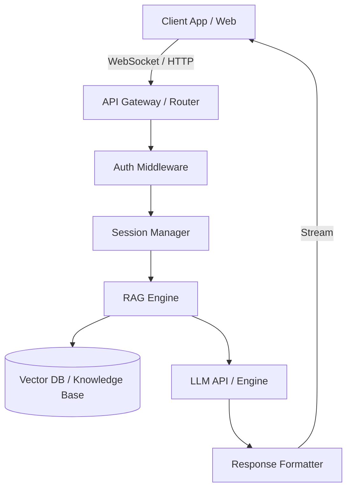
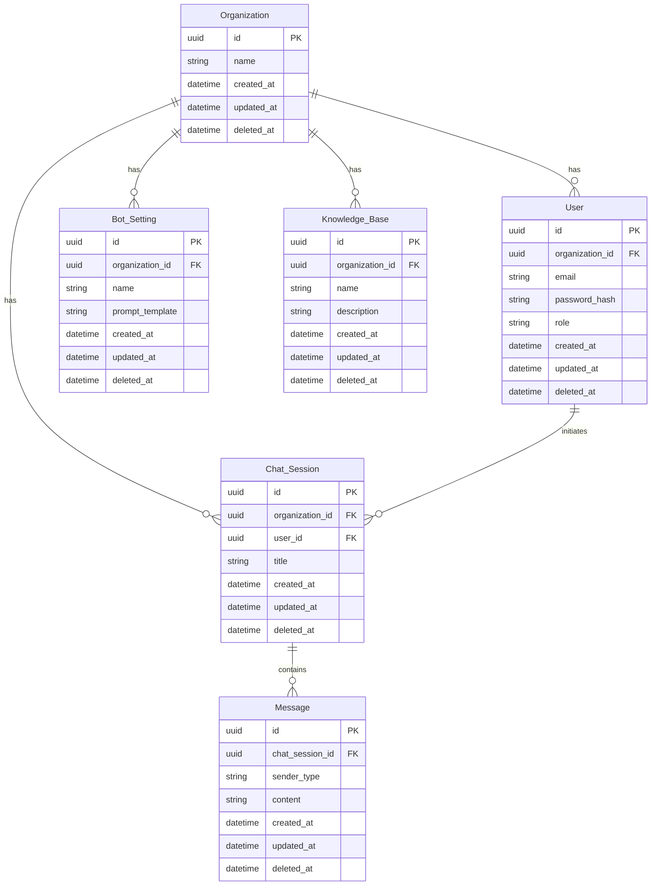

# Architecture Documentation

## System Flowchart

```mermaid
flowchart TD
    Client[Client App / Web] -->|WebSocket / HTTP| Gateway[API Gateway / Router]
    Gateway --> Auth[Auth Middleware]
    Auth --> Session[Session Manager]
    Session --> RAG[RAG Engine]
    RAG --> VectorDB[(Vector DB / Knowledge Base)]
    RAG --> LLM[LLM API / Engine]
    LLM --> Response[Response Formatter]
    Response -->|Stream| Client
```

## Entity Relationship Diagram (ERD)

```mermaid
erDiagram
    Organization {
        uuid id PK
        string name
        datetime created_at
        datetime updated_at
        datetime deleted_at
    }
    User {
        uuid id PK
        uuid organization_id FK
        string email
        string password_hash
        string role
        datetime created_at
        datetime updated_at
        datetime deleted_at
    }
    Bot_Setting {
        uuid id PK
        uuid organization_id FK
        string name
        string prompt_template
        datetime created_at
        datetime updated_at
        datetime deleted_at
    }
    Knowledge_Base {
        uuid id PK
        uuid organization_id FK
        string name
        string description
        datetime created_at
        datetime updated_at
        datetime deleted_at
    }
    Chat_Session {
        uuid id PK
        uuid organization_id FK
        uuid user_id FK
        string title
        datetime created_at
        datetime updated_at
        datetime deleted_at
    }
    Message {
        uuid id PK
        uuid chat_session_id FK
        string sender_type
        string content
        datetime created_at
        datetime updated_at
        datetime deleted_at
    }

    Organization ||--o{ User : "has"
    Organization ||--o{ Bot_Setting : "has"
    Organization ||--o{ Knowledge_Base : "has"
    Organization ||--o{ Chat_Session : "has"
    User ||--o{ Chat_Session : "initiates"
    Chat_Session ||--o{ Message : "contains"
```
